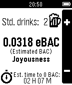
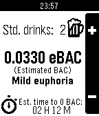
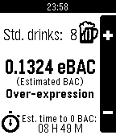

# SoberUp

SoberUp is a Pebble smart watch app for counting standard drinks, estimating BAC, and learning about the effects of alcohol on the body.

SoberUp was made by Team AlumniLikeTurtles: [Kevin Conley](https://github.com/kevincon), [Evan Benshetler](https://github.com/ebensh), [Jeff Kiske](https://github.com/jkiske), and [Matt Hale](https://github.com/yoknapatawpha). It was (mostly) built in under 40 hours at the PennApps Spring 2014 hackathon at the University of Pennsylvania, where it was awarded "Best Pebble Hack" by the Pebble team.

## Screenshots







## Building the project

With the [Pebble SDK installed](developer.getpebble.com), navigate to the root folder of the repository and run:

     pebble build

### Companion website for configuring settings

The code for the website that lets users configure their settings for SoberUp is not available publicly online, but you may contact [Jeff Kiske](https://github.com/jkiske) to request access.

## Contributions

Although we don't plan on developing SoberUp further, we welcome contributions from the community. Here are some possible ideas:

* Refactor the DrinkingState-related structs and functions out of main.c and into a separate file, like state.c.
* Add a "reference sheet" for common types of drinks and how many standard drinks they represent, accessible by clicking the center Pebble button.
* Add different kinds of drink inputs, perhaps configurable from the javascript-based settings page.
* Animate the stopwatch icon while the countdown to 0 BAC is active.
* Animate the cycle of the alcohol effects.

## Attributions

The notification window that blocks users from using the app until they have configured their weight/gender uses code from Chris Lewis's [pebble-alert-lib](https://github.com/C-D-Lewis/pebble-alert-lib).

The design assets in the design folder utilize the following graphics:

* The AlumniLikeTurtles logo is based on [an icon on PhotoBucket](http://media.photobucket.com/user/makes_cake/media/turtle.gif.html?filters[term]=icon%20turtle&filters[primary]=images) uploaded by a user named [makes_cake](http://s747.photobucket.com/user/makes_cake/profile/).
* The beer glass image seen in the background of [soberup-header.png](design/soberup-header.png) is a modified version of ["A couple of beers"](http://www.flickr.com/photos/maya83/5626295710/), which is a photo by [Maya83](http://www.flickr.com/photos/maya83/) on Flickr. We make our modified version available for use under the same [Creative Commons Attribution-ShareAlike 2.0 Generic license](http://creativecommons.org/licenses/by-sa/2.0/) as hers.
* The orange Pebble watch seen in [soberup-header.png](design/soberup-header.png) was created by [Matthew Congrove](https://github.com/mcongrove) and is available under a [Creative Commons Attribution-ShareAlike 4.0 International license](http://creativecommons.org/licenses/by-sa/4.0/deed.en_US) on Github as part of [PebbleUI](https://github.com/mcongrove/PebbleUI).

## License

```
The MIT License (MIT)

Copyright (c) 2014 AlumniLikeTurtles

Permission is hereby granted, free of charge, to any person obtaining a copy of this software and associated documentation files (the "Software"), to deal in the Software without restriction, including without limitation the rights to use, copy, modify, merge, publish, distribute, sublicense, and/or sell copies of the Software, and to permit persons to whom the Software is furnished to do so, subject to the following conditions:

The above copyright notice and this permission notice shall be included in all copies or substantial portions of the Software.

THE SOFTWARE IS PROVIDED "AS IS", WITHOUT WARRANTY OF ANY KIND, EXPRESS OR IMPLIED, INCLUDING BUT NOT LIMITED TO THE WARRANTIES OF MERCHANTABILITY, FITNESS FOR A PARTICULAR PURPOSE AND NONINFRINGEMENT. IN NO EVENT SHALL THE AUTHORS OR COPYRIGHT HOLDERS BE LIABLE FOR ANY CLAIM, DAMAGES OR OTHER LIABILITY, WHETHER IN AN ACTION OF CONTRACT, TORT OR OTHERWISE, ARISING FROM, OUT OF OR IN CONNECTION WITH THE SOFTWARE OR THE USE OR OTHER DEALINGS IN THE SOFTWARE.

A different license may apply to other software included in this package, including the libraries mentioned under "Attributions" above. Please consult their respective headers/websites for the terms of their individual licenses.
```
